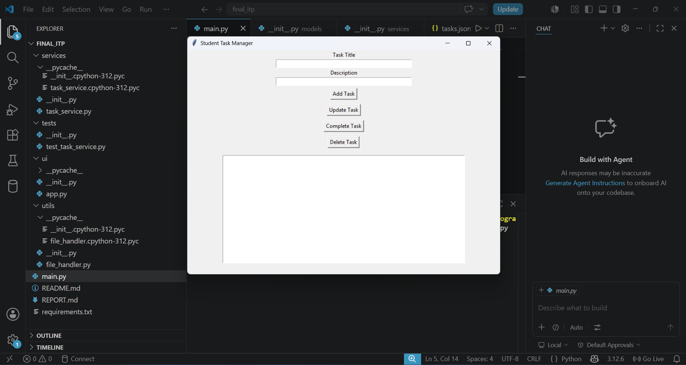
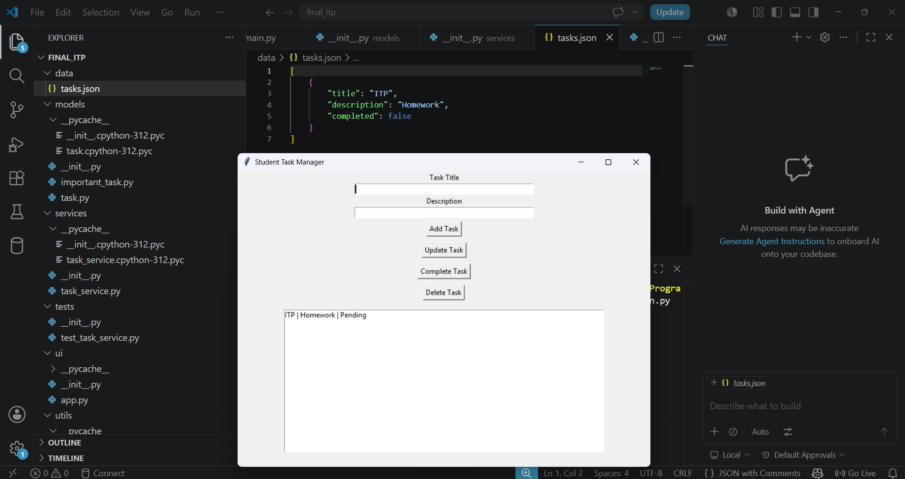
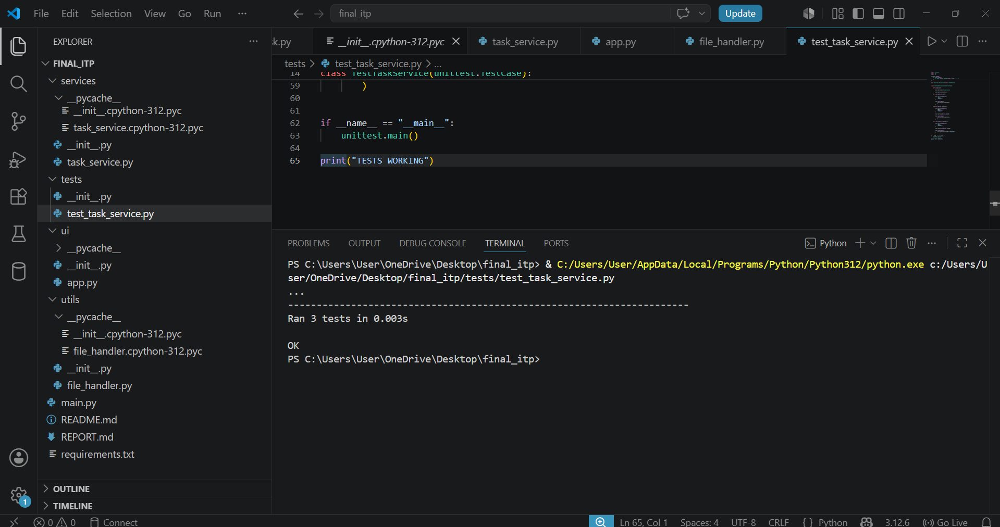

# Student Task Manager

## Project Description
Student Task Manager is a desktop application built with Python and Tkinter.
The application helps students organize and manage academic tasks.

---

## Features

- Add tasks
- Update tasks
- Delete tasks
- Complete tasks
- Save data in JSON
- User-friendly GUI

---

## Technologies Used

- Python
- Tkinter
- JSON
- unittest

---

## Installation

```bash
git clone <repository_link>
cd student_task_manager
pip install -r requirements.txt

## Screenshots

### Main Window


### JSON Storage


### Unit Tests
